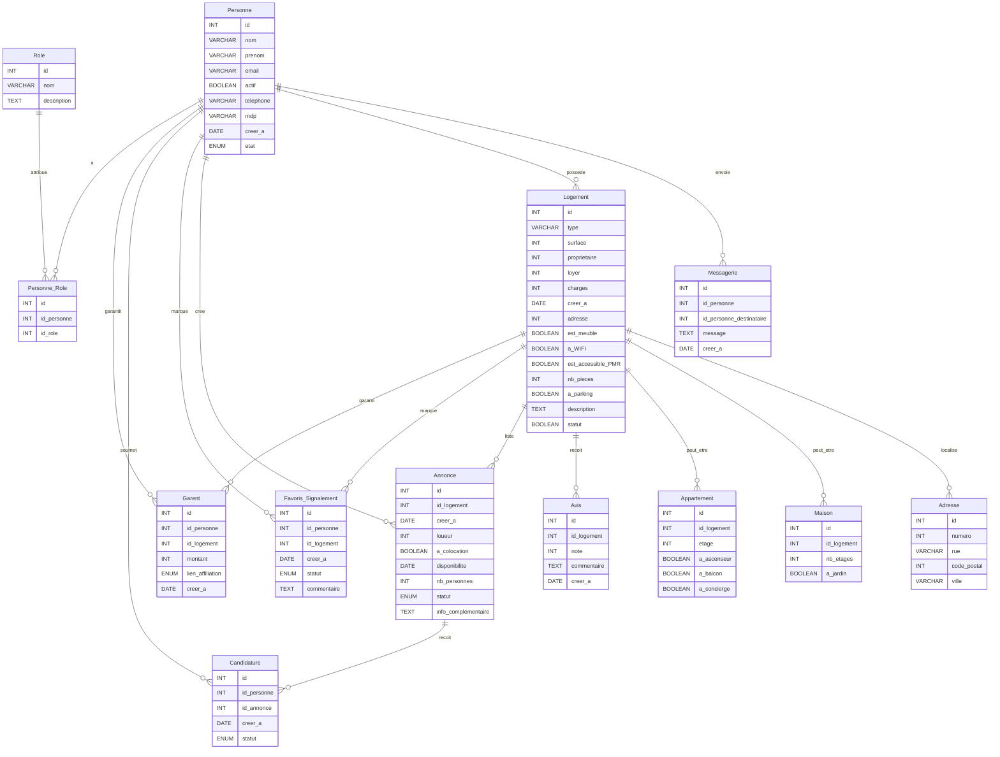

# Schéma de la base de données Aidappart

## Tables

### Personne
| Colonne   | Type              | Contraintes                        |
|-----------|-------------------|------------------------------------|
| id        | INT               | PRIMARY KEY, AUTO_INCREMENT        |
| nom       | VARCHAR(255)      | NOT NULL                           |
| prénom    | VARCHAR(255)      | NOT NULL                           |
| email     | VARCHAR(255)      | NOT NULL, UNIQUE                   |
| actif     | BOOLEAN           | NOT NULL, DEFAULT 0                |
| telephone | VARCHAR(255)      | NOT NULL, UNIQUE                   |
| mdp       | VARCHAR(255)      | NOT NULL                           |
| creer_a   | DATE              | NOT NULL, DEFAULT CURRENT_DATE     |
| etat      | ENUM              | DEFAULT "inactif"                  |

### Messagerie
| Colonne                | Type     | Contraintes                        |
|------------------------|----------|------------------------------------|
| id                     | INT      | PRIMARY KEY, AUTO_INCREMENT        |
| id_personne            | INT      | NOT NULL, FOREIGN KEY              |
| id_personne_destinataire | INT    | NOT NULL, FOREIGN KEY              |
| message                | TEXT     | NOT NULL                           |
| creer_a                | DATE     | NOT NULL, DEFAULT CURRENT_DATE     |

### Logement
| Colonne                | Type        | Contraintes                        |
|------------------------|-------------|------------------------------------|
| id                     | INT         | PRIMARY KEY, AUTO_INCREMENT        |
| type                   | VARCHAR(255)| NOT NULL                           |
| surface                | INT         | NOT NULL                           |
| proprietaire           | INT         | NOT NULL, FOREIGN KEY              |
| loyer                  | INT         | NOT NULL                           |
| charges                | INT         | NOT NULL                           |
| creer_a                | DATE        | NOT NULL, DEFAULT CURRENT_DATE     |
| adresse                | INT         | NOT NULL, FOREIGN KEY              |
| est_meuble             | BOOLEAN     | NOT NULL                           |
| a_WIFI                 | BOOLEAN     | NOT NULL                           |
| est_accessible_PMR     | BOOLEAN     | NOT NULL                           |
| nb_pieces              | INT         | NOT NULL                           |
| a_parking              | BOOLEAN     | NOT NULL                           |
| description            | TEXT        | NOT NULL                           |
| statut                 | BOOLEAN     | DEFAULT FALSE                      |

### Adresse
| Colonne    | Type        | Contraintes                        |
|------------|-------------|------------------------------------|
| id         | INT         | PRIMARY KEY, AUTO_INCREMENT        |
| numero     | INT         | NOT NULL                           |
| rue        | VARCHAR(255)| NOT NULL                           |
| code_postal| INT         | NOT NULL                           |
| ville      | VARCHAR(255)| NOT NULL                           |

### Maison
| Colonne    | Type        | Contraintes                        |
|------------|-------------|------------------------------------|
| id         | INT         | PRIMARY KEY, AUTO_INCREMENT        |
| id_logement| INT         | NOT NULL, FOREIGN KEY              |
| nb_etages  | INT         | NOT NULL                           |
| a_jardin   | BOOLEAN     | NOT NULL                           |

### Appartement
| Colonne    | Type        | Contraintes                        |
|------------|-------------|------------------------------------|
| id         | INT         | PRIMARY KEY, AUTO_INCREMENT        |
| id_logement| INT         | NOT NULL, FOREIGN KEY              |
| etage      | INT         | NOT NULL                           |
| a_ascenseur| BOOLEAN     | NOT NULL                           |
| a_balcon   | BOOLEAN     | NOT NULL                           |
| a_concierge| BOOLEAN     | NOT NULL                           |

### Avis
| Colonne    | Type        | Contraintes                        |
|------------|-------------|------------------------------------|
| id         | INT         | PRIMARY KEY, AUTO_INCREMENT        |
| id_logement| INT         | NOT NULL, FOREIGN KEY              |
| note       | INT         | NOT NULL                           |
| commentaire| TEXT        | NOT NULL                           |
| creer_a    | DATE        | NOT NULL, DEFAULT CURRENT_DATE     |

### Annonce
| Colonne            | Type        | Contraintes                        |
|--------------------|-------------|------------------------------------|
| id                 | INT         | PRIMARY KEY, AUTO_INCREMENT        |
| id_logement        | INT         | NOT NULL, FOREIGN KEY              |
| creer_a            | DATE        | NOT NULL, DEFAULT CURRENT_DATE     |
| loueur             | INT         | NOT NULL, FOREIGN KEY              |
| a_colocation       | BOOLEAN     | NOT NULL                           |
| disponibilite      | DATE        | NOT NULL                           |
| nb_personnes       | INT         | NOT NULL                           |
| statut             | ENUM        | NOT NULL                           |
| info_complementaire| TEXT        | NOT NULL                           |

### Favoris_Signalement
| Colonne    | Type        | Contraintes                        |
|------------|-------------|------------------------------------|
| id         | INT         | PRIMARY KEY, AUTO_INCREMENT        |
| id_personne| INT         | NOT NULL, FOREIGN KEY              |
| id_logement| INT         | NOT NULL, FOREIGN KEY              |
| creer_a    | DATE        | NOT NULL, DEFAULT CURRENT_DATE     |
| statut     | ENUM        | NOT NULL                           |
| commentaire| TEXT        | NOT NULL                           |

### Candidature
| Colonne    | Type        | Contraintes                        |
|------------|-------------|------------------------------------|
| id         | INT         | PRIMARY KEY, AUTO_INCREMENT        |
| id_personne| INT         | NOT NULL, FOREIGN KEY              |
| id_annonce | INT         | NOT NULL, FOREIGN KEY              |
| creer_a    | DATE        | NOT NULL, DEFAULT CURRENT_DATE     |
| statut     | ENUM        | NOT NULL                           |

### Garent
| Colonne          | Type        | Contraintes                        |
|------------------|-------------|------------------------------------|
| id               | INT         | PRIMARY KEY, AUTO_INCREMENT        |
| id_personne      | INT         | NOT NULL, FOREIGN KEY              |
| id_logement      | INT         | NOT NULL, FOREIGN KEY              |
| montant          | INT         | NOT NULL                           |
| lien_affiliation | ENUM        | NOT NULL                           |
| creer_a          | DATE        | NOT NULL, DEFAULT CURRENT_DATE     |

### Role
| Colonne    | Type        | Contraintes                        |
|------------|-------------|------------------------------------|
| id         | INT         | PRIMARY KEY, AUTO_INCREMENT        |
| nom        | VARCHAR(255)| NOT NULL, UNIQUE                   |
| description| TEXT        | NOT NULL                           |

### Personne_Role
| Colonne    | Type        | Contraintes                        |
|------------|-------------|------------------------------------|
| id         | INT         | PRIMARY KEY, AUTO_INCREMENT        |
| id_personne| INT         | NOT NULL, FOREIGN KEY              |
| id_role    | INT         | NOT NULL, FOREIGN KEY              |

## Relations

- `Personne` a une relation avec `Messagerie`, `Logement`, `Annonce`, `Favoris_Signalement`, `Candidature`, `Garent`, et `Personne_Role`.
- `Logement` a une relation avec `Adresse`, `Maison`, `Appartement`, `Avis`, `Annonce`, `Favoris_Signalement`, et `Garent`.
- `Annonce` a une relation avec `Candidature`.
- `Role` a une relation avec `Personne_Role`.

## Schéma Entité-Relation

